# Label Vision

LabelVision is a photo and video annotation tool used to identify people and track their movement from frame to frame. The goal is to use these annotations as an input for a machine learning algorithm to be able to annotate videos automatically. 

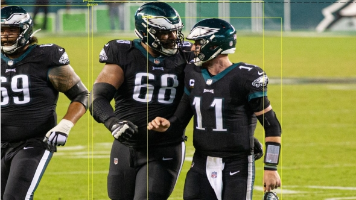

## Python and Pillow Installation

**For a video tutorial of the installation click the following link:** [Installation Tutorial](https://youtu.be/lY63H_KyMaY)

1. LabelVision requires Python 3.6 or greater. This can be downloaded from the [Python downloads page here](https://www.python.org/downloads/). It is recommended that you install Python 3.9.0.  

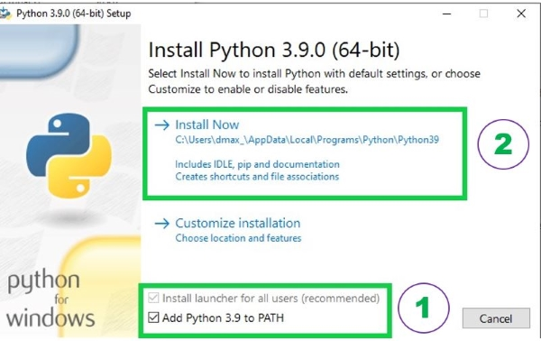

2. After downloading the correct version of Python for your system, the download file.exe should be run. A window will appear that will ask if you would like to install Python to your machine. **During this step, it is vital that you check the box that says "Add Python 3.9 to path".** Continue with the installation.  

3. Following the installation, a window should appear saying "Setup Successful". To check if Python installed correctly, open your command window ("Command Prompt" for Windows; "Terminal" for Mac) 

	If using Windows, your Command Prompt can be opened using the search feature in the bottom right hand side of your screen as shown below.
	
	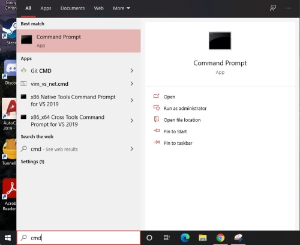
	
	If using Mac, the Terminal can be found using the search feature that is found in the top right hand side of your desktop. 
	
	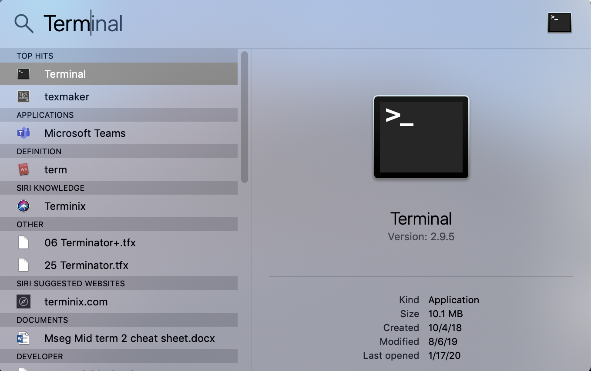

	Once you have your respective command window open, type the following. 
	
		pip3
		
	One of two things will happen. 
	
	**One**: a list of help commands and actions will be displayed (shown below). If this is the case, you have installed python correctly and can move to step four. 
	
	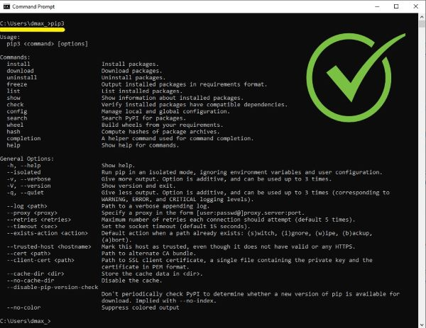
	
	**Two**: the command line will display "pip3 is not recognized as an internal or external command" as shown below. If this is the case, navigate to the Python download.
	
	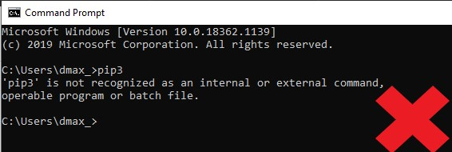
	
	If you see something similar to what is shown directly above, open the Python download .exe file and choose "Modify". Navigate to the final window (Advanced Options) with "Next" and make sure to check the option "Add Python to envrionment variables".
	
	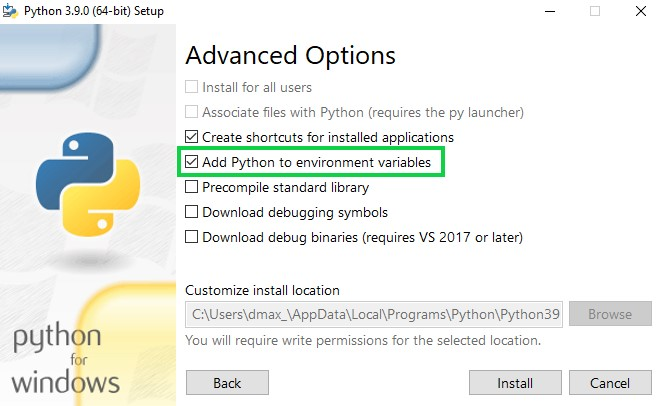
	
	Close your command window and repeat step 3. If this does not solve your issue, navigate to the links below for a more in depth installation of Python for the system of your choice. 

	[Windows](https://www.youtube.com/watch?v=i-MuSAwgwCU&ab_channel=IDGTECHtalk) 

	[Mac](https://www.youtube.com/watch?v=TgA4ObrowRg&ab_channel=AutomationStepbyStep-RaghavPal) 

4.   Following the installation of Python, it is required that you install the Pillow module via the command line. Again, if using a Windows machine, open the "Command Prompt" program. If using a Mac machine, open the "Terminal" program. Once you have opened it, type the following:
	
	pip3 install Pillow

## LabelVision Download and Installation

1. With Python and Pillow installed, you can now download and use LabelVision. From the Github repository, select the drop down green arrow that says "Code" and download the zipped file.

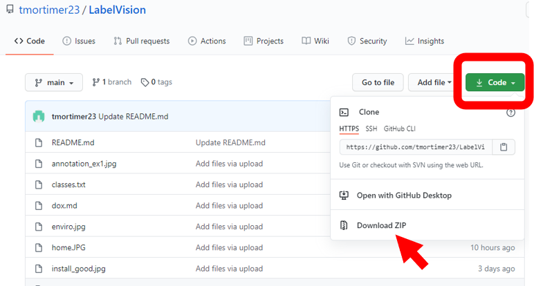

2. Extract these files to a folder called LabelVision and save them in an accessible location by clicking on browse (i.e. the Desktop).

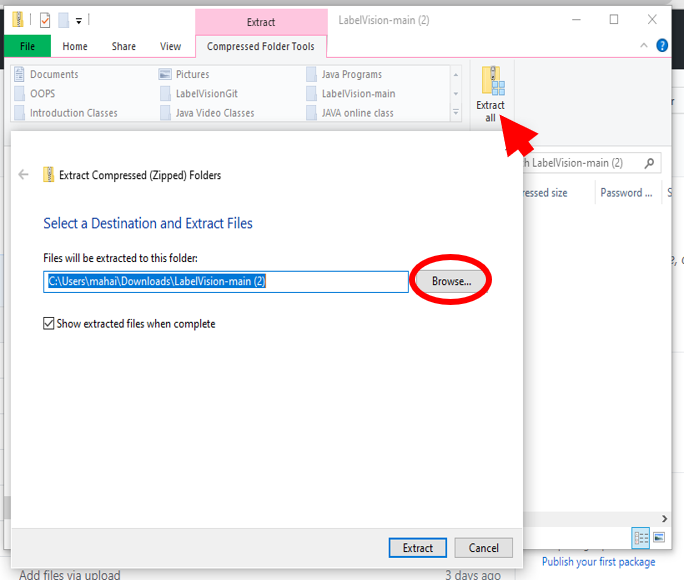

3. To launch the program, navigate to your LabelVision directory, double click on the file main.py.

## Usage

**For a video tutorial on the usage of LabelVision, follow this link:** [LabelVision Usage Video Tutorial](https://youtu.be/5Ukdo_vU1nc)

Using LabelVision is quite simple and there are a minimal amount of controls. If you've launched the program correctly you should see what is displayed below.

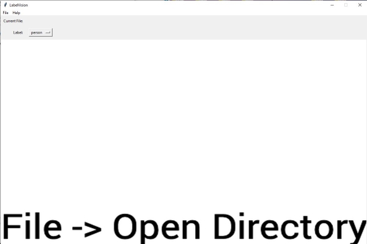

The first step in using the program to annotate video is selecting your directory. Go to "File" -> "Open Directory" in the top left or use Ctrl+O. This will bring you to the files on your computer. For this example, we'll like to open up the folder called "Test Directory" shown below.

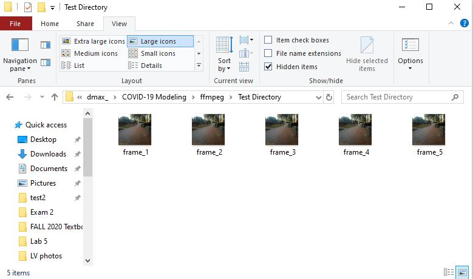

Do this by navigating to the location with which the Test Directory is located. Click **once** on the folder to highlight it, and then choose "Select folder" as shown below. 

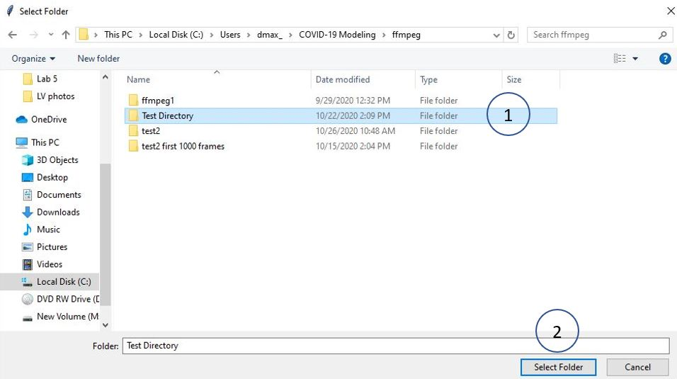

Once you have opened your image directory in LabelVision, the first frame in the set should appear on the screen. Choose a label type from clicking on the default label "person".

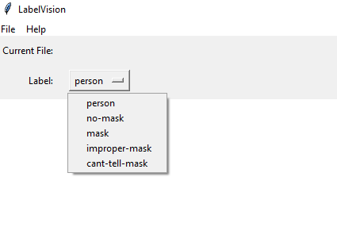

After setting your label type, use the keyboard shortcuts to annotate your images. 

### Shortcuts and Hotkeys

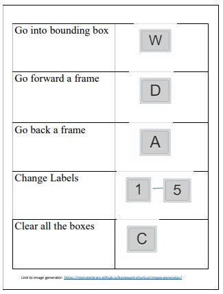

W - with the W key, you can switch between creating annotations by dragging your mouse (the pointer color will be black) and deleting annotations by simply clicking on it (the pointer color will be red in this mode).

A - previous frame

D - next frame

C - clear all bounding boxes

1 - "person" label

2 - "no-mask" label

3 - "mask" label

4 - "improper-mask" label

5 - "cant-tell-mask" label
